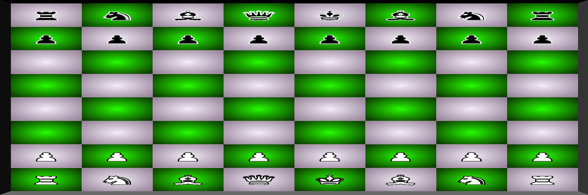

<body>
     

  
 <h1> Jonathan Langner</h1>
  

 

     

      <h3>Designer ~ Web Developer 
        Dynamic and keen web design professional offering crafted skills in website development.
          
        Enjoys designing and scaling creative opportunities to enrich communities and individuals through hands-on interactive design.
          
      </h3>

   

   

    <h3>Personal Website:</h3>
      <a title="https://jonathanlangner.me" href="https://jonathanlangner.me" style="font-size:1.5rem;">
        jonthanlangner.me
      </a> 
    

   

   <h3>Connect With Me:</h3>
      
       
      
        
  
  
  

  
  
  <h3>My Skills:</h3>
      
       
      
       
        
      
      
      
        
        
      
         
         
      
               
      
      
       
      
      
        
       
         
                                          
  

  

     
  
</body>
